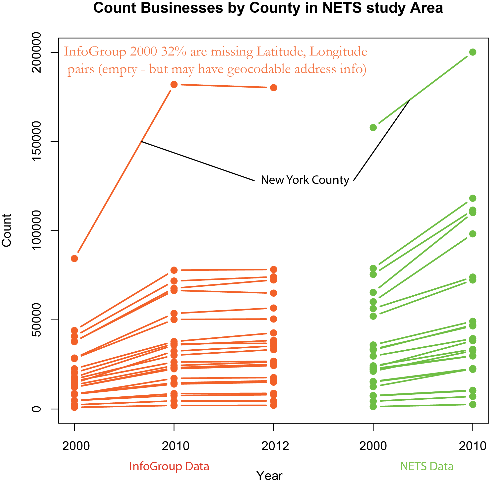

Infogroup
=========

InfoGroup data from DSSC (EDS)

Source data: County data counts for NETS 2000,2010 and Infogroup 2000,2010,2012 [csv](data/county_business_counts_nets_infogroup_final.csv)

####Notes
Here’s a first comparison of the counts of businesses in our 23 counties for NETS and InfoGroup data (attached is a csv and chart for anyone interested). Out of PA,NJ,NY, only 32% of all records for InfoGroup have a pre-existing lat,long pair. So the earliest InfoGroup data would greatly benefit from geocoding. So its important to keep in mind that InfoGroup 2000 is missing 1/3. Also, these NETS calcs are for raw (not collapsed).

I included 2012 mostly b/c I had already done it as a test set, but what’s interesting is for InfoGroup Manhattan actually lost ~2,000 businesses (not sure if that’s a result of missing lat,longs in the 2012 slice or there were less actual businesses from 2010 to 2012). 

There’s ~18,000 more businesses in Manhattan in 2010 for NETS than for InfoGroup. 
For Suffolk county in 2010 NETS has more than 46,000 businesses than InfoGroup
For Nassau county in 2010 NETS has more than 43,000 businesses than InfoGroup (In Nassau NETS 2000 had 75,000 businesses, NETS 2010 had 112,000). 

##Infogroup Documentation

All of the documentataion may be found [here:](https://github.com/nygeog/infogroup/tree/master/documentation) 

####Anecdotal Info
'I think they saw a need and decided to created the data package. They now offer some of that data going back five years from the online database. Much easier to use but restricted to the 200 address download limit.

When we bought it, they told us we would could take it as is without any further cleanup or questions. The documentation was pulled from their website and not included with the purchase..

Here's the site but I can't find the info anymore, thankfully you are holding most of what they had. There were a couple summary tables included I didn't see a need to save.
http://referenceusa-resourcecenter.com/'
